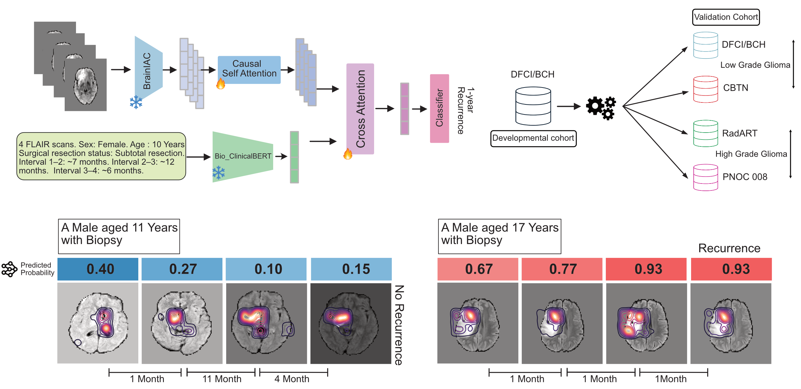

# Vision-Language Model for Event-Free Survival Prediction


<p align="center">
  
</p>

## Overview

This repository provides the code for a vision-language model (VLM) for predicting event-free survival (EFS) for pediatric gliomas from longitudinal MRI scans. Check out the preprint [here](INSERT_YOUR_PREPRINT_LINK_HERE).

## Installation

### Requirements

- Python 3.9+
- PyTorch 2.2+
- PyTorch Lightning
- MONAI
- Transformers (Hugging Face)

### Setup

```bash
# Clone the repository
cd /path/to/vlm_efs

# Create the virtual env
# Create conda environment
conda create -n vlm_efs python=3.9
conda activate vlm_efs
pip install -r requirements.txt
```

### Model Checkpoints
Download the VLM [checkpoint](https://www.dropbox.com/scl/fo/umagqdutg7ke17t8hotgf/ALPBNFEpteYcpbUhl9G5ht4?rlkey=w8n4gal8qsy51hahoilontfjx&st=fbuncx62&dl=0) and place it in ./checkpoints directory:


### Image Preprocessing

The VLM model leverages BrainIAC as its vision encoder. For preprocessing raw DICOM or NIfTI images, please refer to the [BrainIAC documentation](https://github.com/AIM-KannLab/BrainIAC).

## Data Format

### Input Format
- MRI Format: NIFTI (.nii.gz)
- Preprocessing: Bias field correction, Registration to MNI Atlas, HD-BET skull stripping

### Directory Structure

```
dataset/
├── images/          # Preprocessed MRI volumes (nifti format)
│   ├── {pat_id}_{scandate}.nii.gz
│   └── ...
└── text/            # Clinical text descriptions (one per subject)
    ├── {pat_id}_{scandate1}_{scandate2}_...txt
    └── ...
```

### CSV Format

Training and validation CSVs should contain the following columns:

```csv
pat_id,scandates,label
P001,20200101-20200215,1
P002,20200110-20200220-20200330,0
```

### Clinical Text Description File

For each subject, provide a clinical text description in a separate text file in the [text](/dataset/text/) directory. 

The filename should encode the patient ID followed by all scan dates separated by underscores. For example  - 2911_19981028_19991103_20021211_20180116_20180913.txt

Format Each subject to have only **one** corresponding text file relevant details such as imaging timepoints, sex, age at diagnosis, surgical resection status, and time intervals between scans.

```
5 FLAIR scans. Sex: Male. Age at diagnosis: 3.28 years. Surgical resection status: Subtotal resection. Interval 1–2: ~12 months. Interval 2–3: ~38 months. Interval 3–4: ~184 months. Interval 4–5: ~8 months.
```

## Usage

Set the training/validation specific paramters and text encoders in the [config](/configs/config.py) file.

### Training

Train the model using PyTorch Lightning:

```bash
python train.py
```

### Inference

Run inference on a test set:

```bash
python inference_finegrained.py 
```

The inference script outputs:
- predictions_{checkpoint_name}.csv : Predictions with patient IDs, labels, binary predictions, and model scores
- calibration_{checkpoint_name}.png : Calibration plot of the model scores 
- inference_results.json: Classifiation metrics 


## License

This project is licensed under the Creative Commons Attribution-NonCommercial 4.0 International (CC BY-NC 4.0) License.
For more details, see the [CC BY-NC 4.0 License](https://creativecommons.org/licenses/by-nc/4.0/).


